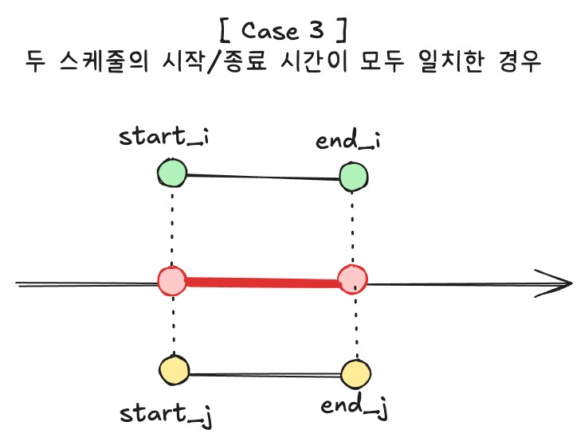

# 스케줄 검증하기

## 문제 상황

1개의 회의실을 가지고 여러 팀이 회의실을 나눠쓰고자 합니다.  
회의실 사용 스케줄을 하나로 취합하여 겹치는 기간이 있는지 검증하고자합니다.

데이터는 2차원 배열로 입력받으며, 스케줄은 `["시작 일시", "종료 일시"]`형태로 되어있습니다.  
예를 들어 다음과 같은 형식으로 입력받습니다.

```bash
[
  // [시작 일시, 종료 일시]
  ["2025-09-01T00:00:00.000Z", "2025-09-01T01:00:00.000Z"],
  ["2025-09-01T00:30:00.000Z", "2025-09-01T01:30:00.000Z"],
  ["2025-09-01T02:00:00.000Z", "2025-09-01T03:00:00.000Z"]
]
```

위 데이터는 0번과 1번이 겹치며, `2025-09-01T00:30:00.000Z` ~ `2025-09-01T01:00:00.000Z` 기간 동안 겹칩니다.
2번은 겹치지 않아 정상 스케줄입니다.

어느 스케줄과 충돌하는지, 겹치는 기간이 어느 정도인지 출력하세요.

> 추가 설명

1. 날짜/시간은 ISO8601(yyyy-MM-dd'T'HH:mm:ss.sss'Z') 형식으로 입/출력합니다.
2. 모든 입력 데이터의 스케줄은 종료 일시가 시작 일시보다 빠를 수 없습니다. (검증 필요 없음)
3. 모든 입력 데이터의 스케줄은 시작 일시와 종료 일시가 같을 수 없습니다. (검증 필요 없음)
4. 특정 스케줄의 종료 일시가 다른 스케줄의 시작 일시와 동일한 경우에는 겹치지 않은 것으로 간주합니다.
5. 겹치는 스케줄은 'n번 vs m번 : <겹친 일시 시작> ~ <겹친 일시 종료>' 형식으로 출력합니다.
6. 외부 라이브러리(moment.js, luxon, day.js 등)를 사용할 수 없고, Date 객체 사용 가능합니다.

> 입력

```json
[
  ["2025-08-22T13:43:00.000Z", "2025-08-22T15:54:00.000Z"],
  ["2025-08-22T14:28:00.000Z", "2025-08-22T16:03:00.000Z"],
  ["2025-08-22T16:15:00.000Z", "2025-08-22T21:48:00.000Z"],
  ["2025-08-22T16:55:00.000Z", "2025-08-22T18:55:00.000Z"],
  ["2025-08-22T19:50:00.000Z", "2025-08-22T21:46:00.000Z"]
]
```

> 출력

```json
[
  "0번 vs 1번 : 2025-08-22T14:28:00.000Z ~ 2025-08-22T15:54:00.000Z",
  "2번 vs 3번 : 2025-08-22T16:55:00.000Z ~ 2025-08-22T18:55:00.000Z",
  "2번 vs 4번 : 2025-08-22T19:50:00.000Z ~ 2025-08-22T21:46:00.000Z"
]
```

---

## 문제 해결 방안 (1)

BruteForce 로 모든 스케줄쌍을 비교하는 방법이 있습니다.
모든 스케줄쌍들을 비교해야하므로 시간복잡도는 `O(N^2)` 입니다.

해당 코드로직은 SolutionService의 handleSolution01 메서드에 있으며
`[POST] /api/solutions/one` API를 호출하여 확인할 수 있습니다.

```ts
handleSolution01(schedules) {
    const results :string[]= [];

    // 모든 스케줄쌍(시작일시,종료일시)들을 비교합니다.
    for(let i=0; i<schedules.length; i++) {
        for(let j=i+1; j<schedules.length; j++) {
            const [start_i, end_i] = schedules[i].map(d => new Date(d));
            const [start_j, end_j] = schedules[j].map(d => new Date(d));

            // 겹치는 구간이 있는지 확인합니다.
            if(start_i < end_j && start_j < end_i) {
                // 겹치는 구간을 계산 합니다.
                const overlapStart = new Date(Math.max(start_i.getTime(), start_j.getTime()));
                const overlapEnd = new Date(Math.min(end_i.getTime(), end_j.getTime()));

                // 결과리스트에 겹치는 구간을 넣습니다.
                results.push(`${i}번 vs ${j}번 : ${overlapStart.toISOString()} ~ ${overlapEnd.toISOString()}`);
            }
        }
    }

    return results;
}
```

## 문제 해결 방안 (2)

문제 해결 방안 (1) 에서는 전체의 스케줄들을 비교하는 방법이라면
모든 스케줄이 겹치는 최악의 상황이 아니라면, 먼저 스케줄들을 정렬시킨뒤에 스케줄쌍을 비교하지만 현재기준의 스케줄은 성능을 최적화 할 수 있습니다.

이는 Sweep Line 알고리즘으로 해결할 수 있습니다.
Sweep Line 알고리즘은 먼저 정렬을 시켜서 비교하여 처리하는 방식을 의미합니다.

해당 코드로직은 SolutionService의 handleSolution02 메서드에 있으며
`[POST] /api/solutions/two` API를 호출하여 확인할 수 있습니다.

```ts
handleSolution02(schedules: Schedule[]) {
    // 시작시각 기준으로 인덱스와 함께 정렬합니다.
    const sortedSchedules = schedules.map((schedule, i) =>({
        index: i,
        start: new Date(schedule[0]),
        end: new Date(schedule[1]),
    })).sort((a, b) => a.start.getTime() - b.start.getTime());

    const results :string[] = [];

    // 시작시간을 기준으로 정렬을 했으므로
    // next.start >= curr.end 조건해당되는 스케줄과 그 이후의 스케줄들은 넘어갑니다.
    for(let i=0; i<sortedSchedules.length; i++) {
        // 현재 스케줄: indexed[i]
        const curr = sortedSchedules[i];

        // 비교 스케줄: indexed[j]
        for(let j=i+1; j<sortedSchedules.length; j++) {
          const next = sortedSchedules[j];

          // 겹치는 시간이 없고, 이후스케줄과 더이상 비교할 필요 없습니다.
          if(next.start >= curr.end) break;

          // 겹치는 스케줄시간 인지 확인합니다.
          if(next.start < curr.end && curr.start < next.end) {

            // 겹치는 스케줄시간
            const overlapStart = new Date(Math.max(curr.start.getTime(), next.start.getTime()));
            const overlapEnd = new Date(Math.min(curr.end.getTime(), next.end.getTime()));

            // 인덱스를 비교합니다.
            const [firstIdx, secondIdx] = curr.index < next.index ? [curr.index, next.index] : [next.index, curr.index];

            results.push(`${firstIdx}번 vs ${secondIdx}번 : ${overlapStart.toISOString()} ~ ${overlapEnd.toISOString()}`)
          }
        }
    }

    return results;
}
```

---

## 고민포인트 1. 겹치는 스케줄시간을 어떻게 찾을까?

문제를 분석하면서 접근을 하고자 할때 가장먼저 생각난 고민 포인트는 "겹치는 스케줄을 어떻게 찾을까?" 에 대해서 고민을 했습니다.

완전탐색으로 스케줄 2개를 비교하는 방식으로 접근을 했고 그림을 그려보면서 케이스를 정리해봤으며, 스케줄이 겹침이 생길 때 공통점을 찾아보는 방법으로 수행했습니다.

스케줄배열의 스케줄i(i=0 ~ 스케줄배열길이 -1)와 비교대상인 스케줄j(j=i+1 ~ 스케줄배열길이-1)가 있다고 할 때

스케줄i, 스케줄j 의 [ 시작일시, 종료일시 ]를 각각 [`start_i`, `end_i`], [`start_j`, `end_j`] 로 나타냈습니다.

<br>

> ### case 1. 겹치는 스케줄시간이 (start_i, end_j) 인 경우


> ### case 2. 겹치는 스케줄시간이 (start_j, end_i) 인 경우


> ### case 3 - 스케줄i와 스케줄j 가 완전히 겹치는 경우



케이스 3가지에서의 공통점은 아래 2개의 조건 모두 충족해야합니다.

- (조건1) `start_i` < `end_j`
- (조건2) `start_j` < `end_i`

<br>

반대로 2개의 조건중 어느 하나라도 만족을 하지 않는다면 두 스케줄 i,j 사이의 겹치는 스케줄시간이 존재하지 않습니다.

- (조건1)을 만족하지 않은 경우: `start_i` >= `end_j`  
  
- (조건2)를 만족하지 않은 경우: `start_j` >= `end_i`
  

<br><br>

## 고민포인트 2. 시간데이터를 어떻게 숫자처럼 크기 비교할 수 있을까?

겹치는 스케줄시간 조건 2개에 모두 충족됐을 때, 겹치는 스케줄시간의 시작일시 와 종료일시 를 구하려면 두 스케줄 i,j의 시작일시와 종료일시를 비교해야합니다.

- `Math.max(start_i, start_j)`: 겹치는 스케줄시간의 시작일시(overlapStart)의 경우에는 두개의 시작일시중 큰값에 해당됩니다.
- `Math.min(end_i, end_j)`: 겹치는 스케줄시간의 종료일시(overlapEnd)의 경우에는 두개의 종료일시중 작은값에 해당됩니다.

하지만 외부라이브러리 없이, 날짜데이터의 크기를 어떻게 비교할 수 있을지 고민을 했습니다. 날짜를 나타내는 Date 객체는 비교할 수 있는 숫자타입이 아닌 참조형타입이기 때문에 Math 라이브러리의 max, min으로 비교하기가 어려웠습니다.

<br>

> Date 객체의 getTime() 메서드를 이용하자

[MDN 공식문서](https://developer.mozilla.org/ko/docs/Web/JavaScript/Reference/Global_Objects/Date/getTime)에서 `Date.getTime()`은 1970년 1월 1일 00:00:00UTC 를 기준으로 경과한 시간을 밀리초(ms)로 단위로 나타내줍니다. 반대로 경과를 비교하려는 날짜가 기준보다 과거의 날짜라면 음수로 나타냅니다.

```ts
const overlapStart = new Date(Math.max(start_i.getTime(), start_j.getTime())); // 겹치는 스케줄시간 시작일시
const overlapEnd = new Date(Math.min(end_i.getTime(), end_j.getTime())); // 겹치는 스케줄시간 종료일시
```

<br>

## 고민포인트 3. 성능고도화 - Sweep Line 알고리즘

완전탐색방법으로는 전체원소를 탐색하게되므로 시간복잡도는 O(N^2) 입니다.
데이터가 많아질수록 전부다 비교해야되기때문에 스케줄데이터가 점점 많아지면 그만큼 시간이 느려집니다.

고민을해보다가 AI 에이전트에게 검색을 해봤습니다.
AI에이전트에서는 'Sweep Line' 알고리즘으로 힌트를 줬습니다.
먼저 스케줄 데이터들을 정렬시켜서 비교하여 처리하는 방법이기때문에
시간복잡도를 `O(NlogN + N * K) (단, K<= N)` 를 가집니다.
같은 데이터더라도 완전탐색방법 보다 적으면 2배, 많으면 100배 정도의 빠른속도를 가집니다.

<br>

예를들면, 4개의 스케줄 데이터가 있다고 가정합니다.

| index |      start(시작일시)       |       end(종료일시)        |
| :---: | :------------------------: | :------------------------: |
|   0   | "2025-08-22T14:28:00.000Z" | "2025-08-22T16:03:00.000Z" |
|   1   | "2025-08-22T19:50:00.000Z" | "2025-08-22T21:46:00.000Z" |
|   2   | "2025-08-22T13:43:00.000Z" | "2025-08-22T15:54:00.000Z" |
|   3   | "2025-08-22T16:15:00.000Z" | "2025-08-22T21:48:00.000Z" |

start(시작일시) 값을 기준으로 오름차순으로 정렬을 합니다. 정렬된 데이터는 다음과 같습니다.

<br><br>

> phase 1: index=2인 스케줄을 기준으로 할 때

|  index   |      start(시작일시)       |       end(종료일시)        |
| :------: | :------------------------: | :------------------------: |
| 2 (curr) | "2025-08-22T13:43:00.000Z" | "2025-08-22T15:54:00.000Z" |
|    0     | "2025-08-22T14:28:00.000Z" | "2025-08-22T16:03:00.000Z" |
|    3     | "2025-08-22T16:15:00.000Z" | "2025-08-22T21:48:00.000Z" |
|    1     | "2025-08-22T19:50:00.000Z" | "2025-08-22T21:46:00.000Z" |

index는 맨처음 입력데이터의 배열의 인덱스를 의미합니다.
맨처음에는 index=2인 스케줄을 기준(curr)으로 하며, 최대 3개의 스케줄과 비교합니다.
curr은 index=2인 스케줄이며 next는 curr과의 비교대상이며 index=0,3,1 인 스케줄입니다.

- next: index=0인 스케줄

`curr.end > next.start` 를 만족하므로 겹치는 스케줄시간은 `("2025-08-22T14:28:00.000Z", "2025-08-22T15:54:00.000Z")` 입니다.

<br>

- next: index=3인 스케줄

그런데 `curr.end <= next.start` 조건일 경우에는 겹치는 구간이 존재하지 않기에 비교를 하지 않고 넘어갑니다.
이미 정렬이 됐으므로 그이후에 index=1인 스케줄도 자연스럽게 비교를 하지 않습니다.

<br>

> 2. phase 2: index=0인 스케줄을 기준으로 할 때

|  index   |      start(시작일시)       |       end(종료일시)        |
| :------: | :------------------------: | :------------------------: |
|    2     | "2025-08-22T13:43:00.000Z" | "2025-08-22T15:54:00.000Z" |
| 0 (curr) | "2025-08-22T14:28:00.000Z" | "2025-08-22T16:03:00.000Z" |
|    3     | "2025-08-22T16:15:00.000Z" | "2025-08-22T21:48:00.000Z" |
|    1     | "2025-08-22T19:50:00.000Z" | "2025-08-22T21:46:00.000Z" |

맨처음으로 겹치는 구간이 없는 경우에는 비교하지 않고 기준도 다음순서로 변경됩니다.
curr은 index=0인 스케줄이며, next는 index=3,1인 스케줄입니다. 최대 2개의 스케줄과 비교합니다.

- next: index=3인 스케줄
  `curr.end < next.start` 이므로 비교하지않고 다음순서로 넘어갑니다.

<br>

> 3. phase 3: index=3인 스케줄

|  index   |      start(시작일시)       |       end(종료일시)        |
| :------: | :------------------------: | :------------------------: |
|    2     | "2025-08-22T13:43:00.000Z" | "2025-08-22T15:54:00.000Z" |
|    0     | "2025-08-22T14:28:00.000Z" | "2025-08-22T16:03:00.000Z" |
| 3 (curr) | "2025-08-22T16:15:00.000Z" | "2025-08-22T21:48:00.000Z" |
|    1     | "2025-08-22T19:50:00.000Z" | "2025-08-22T21:46:00.000Z" |

curr은 index=3인 스케줄이며, next는 index=1인 스케줄입니다. 최대 1개의 스케줄과 비교합니다.

- next: index=1인 스케줄
  `curr.end > next.start` 를 만족합니다. 만족하게되면 겹치는 스케줄시간의 시작일시와 종료일시는 비교를통해 결정됩니다.
  - 시작일시는 둘중 큰값이 선택되며(`Math.max(curr.start, next.start)`)
  - 종료일시는 둘중 작은값이 선택됩니다(`Math.min(curr.end, next.end)`)

  따라서 겹치는 구간은 `("2025-08-22T19:50:00.000Z", "2025-08-22T21:46:00.000Z")` 입니다.

따라서 2개의 데이터의 결과를 가집니다.

```json
[
  "0번 vs 2번 : 2025-08-22T14:28:00.000Z ~ 2025-08-22T15:54:00.000Z",
  "1번 vs 3번 : 2025-08-22T19:50:00.000Z ~ 2025-08-22T21:46:00.000Z",
];
```

---

## 회고

- 단순히 문제 해결뿐만 아니라 기술스택에 JD에 맞춰 API로 응답결과를 나타내보는 시도를 해봤습니다.

- 2개의 문제 해결방법에서의 성능차이를 시간복잡도로 나타내고싶었고, 동일한 데이터에 대한 처리속도를 편하게 비교하기 위해서 React-Vite 기반의 웹UI를 만들어보는 시도를 해봤습니다. 웹UI는 AI엔진의 도움을 받아서 해봤습니다.

- 알고리즘 문제를 푸는 과정에 있어서 어디서 막혔는지 '문제 정의' 를 구체적으로 글로 표현하는게 쉽지 않았지만 단순히 해결했다는 결과 보다는 '문제정의'/'문제해결과정' 을 기록해보는 과정에 집중하기로 했습니다.

- O(N^2) 의 시간복잡도는 스케줄리스트의 스케줄수가 많을 수록 느려질 수 있어서 성능저하가 있을 수 있기때문에 어떻게 성능개선을 할지 고민을 했고 이를 글로 설명해보려는 시도를 했습니다.

---

## 테스트 실행방법


- Node버젼: Node v22
- 패키지매니저: yarn
- 서버포트: 3000
- 클라이언트 포트: 5173

### 웹서버 실행방법 - 터미널 명령어

```bash
nvm use 22
yarn server
```

### 웹클라이언트(리액트) 실행방법 - 터미널 명령어

```bash
nvm use 22
yarn client
```

### 직접 입력한 데이터를 테스트할 때 유의사항 - 인풋데이터 예시

- JSON 문법에 맞게 해야하며, 배열로 나타내야합니다.
- 문자열은 쌍따옴표("")로 나타내야합니다.
- 마지막원소에 ',' 를 포함시키지 않습니다.
- 주석을 넣을 수 없습니다.

> Good Case 예시

```json
[
  ["2025-08-22T14:28:00.000Z", "2025-08-22T16:03:00.000Z"],
  ["2025-08-22T19:50:00.000Z", "2025-08-22T21:46:00.000Z"],
  ["2025-08-22T13:43:00.000Z", "2025-08-22T15:54:00.000Z"],
  ["2025-08-22T16:15:00.000Z", "2025-08-22T21:48:00.000Z"]
]
```

> Bad Case 예시 1 - 맨마지막 원소에 ','를 포함하지 않습니다.

```bash
[
  ['2025-08-22T14:28:00.000Z', '2025-08-22T16:03:00.000Z'],
  ['2025-08-22T19:50:00.000Z', '2025-08-22T21:46:00.000Z'],
  ['2025-08-22T13:43:00.000Z', '2025-08-22T15:54:00.000Z'],
  ['2025-08-22T16:15:00.000Z', '2025-08-22T21:48:00.000Z'],
]
```

> Bad Case 예시 2 - 문자열은 반드시 쌍따옴표를 사용합니다. 홑따옴표('')는 허용하지 않습니다.

```bash
[
  ['2025-08-22T14:28:00.000Z', '2025-08-22T16:03:00.000Z'],
  ['2025-08-22T19:50:00.000Z', '2025-08-22T21:46:00.000Z'],
  ['2025-08-22T13:43:00.000Z', '2025-08-22T15:54:00.000Z'],
  ['2025-08-22T16:15:00.000Z', '2025-08-22T21:48:00.000Z']
]
```
